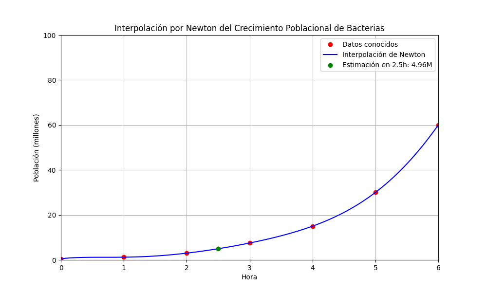

# Interpolación por Newton para determinar un valor estimado de la población bacterial en un tiempo $t$

Se cuenta con los siguientes datos sobre el crecimiento
bacterial de Escherichia coli (E. coli). Estos datos simulan el crecimiento en un medio de cultivo a lo largo del tiempo.

|Tiempo (horas)|Población (millones)|
|:-:|:-:|
|0|0.5|
|1|1.2|
|2|3.0|
|3|7.5|
|4|15.0|
|5|30.0|
|6|60.0|

## Solución

Con ayuda de la inteligencia artificial **POE** obtenemos la solución en python para dterminar la población de bacterias despues de **2.5 horas** aplicando interpolación por Newton.

```{python}
import numpy as np
import matplotlib.pyplot as plt

# Datos de ejemplo
horas = np.array([0, 1, 2, 3, 4, 5, 6])
poblacion = np.array([0.5, 1.2, 3.0, 7.5, 15.0, 30.0, 60.0])
# Función para calcular los coeficientes de la interpolación de Newton
def newton_interpolation(x, y, x_eval):
    n = len(x)
    coef = np.zeros((n, n))
    coef[:, 0] = y
    
    for j in range(1, n):
        for i in range(n - j):
            coef[i][j] = (coef[i + 1][j - 1] - coef[i][j - 1]) / (x[i + j] - x[i])

    # Evaluación del polinomio interpolante
    result = coef[0, 0]
    for j in range(1, n):
        term = coef[0, j]
        for i in range(j):
            term *= (x_eval - x[i])
        result += term

    return result

# Evaluar en un momento específico
hora_eval = 2.5
poblacion_estimada = newton_interpolation(horas, poblacion, hora_eval)

# Generar puntos para el gráfico
x_range = np.linspace(0, 6, 100)
y_range = [newton_interpolation(horas, poblacion, x) for x in x_range]

# Gráfico
plt.figure(figsize=(10, 6))
plt.plot(horas, poblacion, 'ro', label='Datos conocidos')
plt.plot(x_range, y_range, 'b-', label='Interpolación de Newton')
plt.scatter(hora_eval, poblacion_estimada, color='green', label=f'Estimación en {hora_eval}h: {poblacion_estimada:.2f}M', zorder=5)
plt.title('Interpolación por Newton del Crecimiento Poblacional de Bacterias')
plt.xlabel('Hora')
plt.ylabel('Población (millones)')
plt.legend()
plt.grid()
plt.xlim(0, 6)
plt.ylim(0, 100)
plt.show()
```
## Resultados



Los resultados muestran que el número de bacterias estimado despues de **2.5 horas** es de **4.96 millones** de bacterias.

# Conclusiones

El método de interpolación por Newton es utilizado principalmente dentro del rango de los datos conocidos.

Para este caso la hora debe estar en un intervalo de $[0, 6]$ para obtener buenas estimaciónes, si la hora está fuera del intervalo de $[0, 6]$ (horas) puede conllevar riesgos: mientras más alejados de los datos conocidos, más inexactas y menos confiables serán las estimaciones.